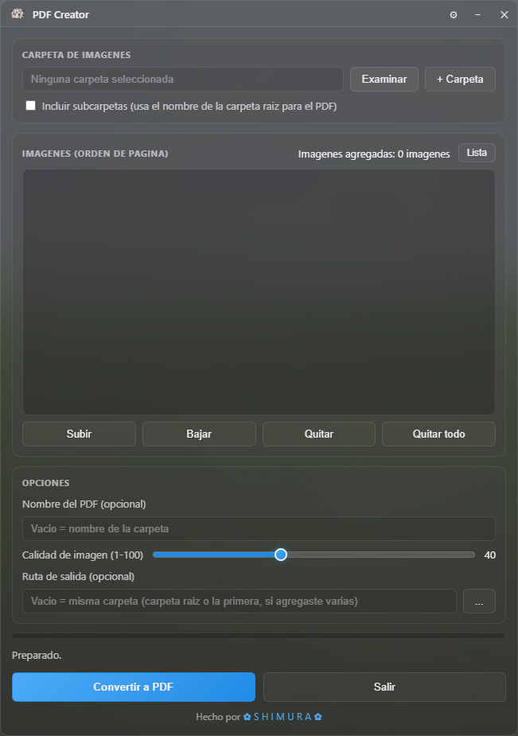

# ConvertidorPDF (Electron)




## Descripcion de funcionamiento

Toda la conversion de imagenes (lectura de JPG/PNG/WEBP/AVIF/BMP, miniaturas,
normalizacion a JPEG con la calidad elegida) la hace `sharp`
(libvips), que es una dependencia npm con binarios precompilados — no un
`.exe` externo que haya que descargar, instalar o mandar por separado
— es una app Electron comun, con la misma huella que miles de apps
legitimas (VS Code, Slack, Discord, y el propio YT-DLP Minimalist).
El armado del PDF lo hace `pdf-lib` (tambien npm, sin binarios externos).


## Funciones incluidas (igual que la version PowerShell)

- Elegir carpeta / agregar carpetas o imagenes sueltas adicionales
- Incluir subcarpetas (recursivo)
- Lista de imagenes reordenable: botones Subir/Bajar/Quitar/Quitar todo, **y
  ahora tambien arrastrando los items con el mouse** (drag&drop nativo del
  navegador, sin dependencias extra)
- Vista de miniaturas (boton "Miniaturas")
- Calidad de imagen ajustable (1-100)
- Nombre de PDF y ruta de salida opcionales
- Barra de progreso durante la conversion
- Abrir con / arrastrar y soltar una carpeta o imagenes desde el Explorador
- Orden natural de archivos (Imagen2 antes que Imagen10)
- Descomprimir `.zip` / `.cbz` y agregar las imagenes de adentro
- **`.rar` / `.cbr`**: soportado si el usuario tiene 7-Zip o WinRAR
  instalados (se detectan automaticamente las rutas tipicas de instalacion:
  `Program Files\7-Zip\7z.exe`, `Program Files\WinRAR\UnRAR.exe`, etc., igual
  que hacia la version PowerShell). Si no hay ninguno instalado se avisa con
  un mensaje claro en vez de fallar en silencio. No se distribuye ningun
  binario de RAR con la app (evita el tema de licencias).
- **Ventana transparente/acrilica**: `BrowserWindow` se crea con
  `frame: false` y `transparent: true`. El desenfoque nativo
  (`backgroundMaterial: 'acrylic'` en Windows 11 22H2+, `vibrancy` en macOS)
  esta soportado y detectado en `main.js`, pero queda desactivado por
  defecto (`USAR_BLUR_NATIVO = false`) porque su intensidad es fija y no
  responde a la barra "Desenfoque" del panel de opciones; el blur activo por
  defecto es el de CSS (`backdrop-filter`), que si es ajustable. Barra de
  titulo propia con icono,
  minimizar y cerrar (arrastrable via `-webkit-app-region: drag`), esquinas
  redondeadas (`roundedCorners: true`) y un tinte semitransparente por CSS
  como respaldo para cuando el acrilico no esta disponible (Windows 10,
  Linux, etc. — en esos casos se ve un fondo oscuro solido normal, sin
  romper nada).

  ## Requisitos para compilarla tu mismo

- [Node.js](https://nodejs.org) 18 o superior

## Desarrollo

```bash
npm install
npm start
```

## Generar el .exe

```bash
npm run dist
```

Genera un instalador `.exe` (NSIS) y una version portable en `dist/`, igual
que YT-DLP Minimalist. No hace falta empaquetar nada mas: `sharp` y
`pdf-lib` quedan incluidos en el paquete de Electron automaticamente.

Falta el icono: poné tu `.ico` en `assets/icon.ico` antes de compilar (o
sacá la linea `"icon": "assets/icon.ico"` de `package.json` si todavia no
tenés uno).
